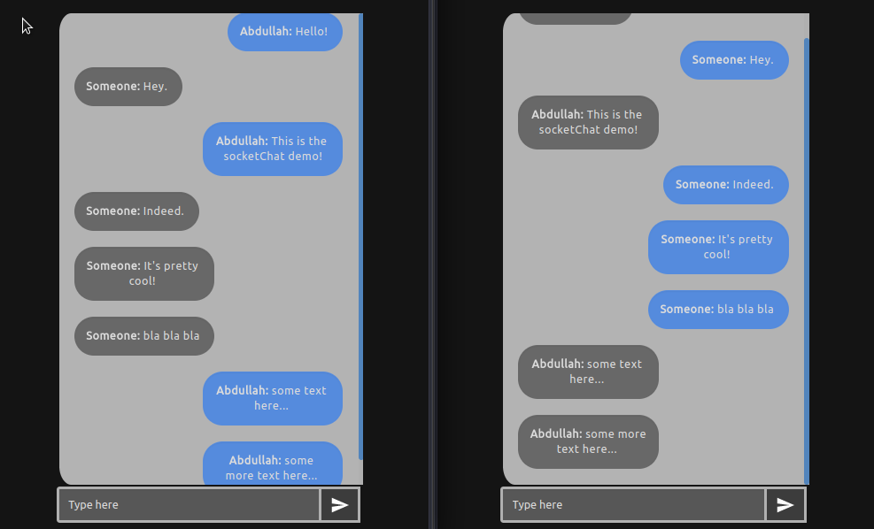

# socketChat
A simple, real-time, and secure messaging application.

socketChat was built with [Node.js](https://nodejs.org/en/), using [Socket.io](https://socket.io).

___
## Demo:
##### Login demo:

##### Chat demo:

## Running
If you'd like to run this app:
- `git clone https://github.com/abdullah-K/socketChat`.
- run `npm install` and let it finish.
- modify line `19` in `server.js` to whatever port you want to use.
- run `node server.js` and visit localhost:YOUR_PORT.
- have fun chatting with people, securely!