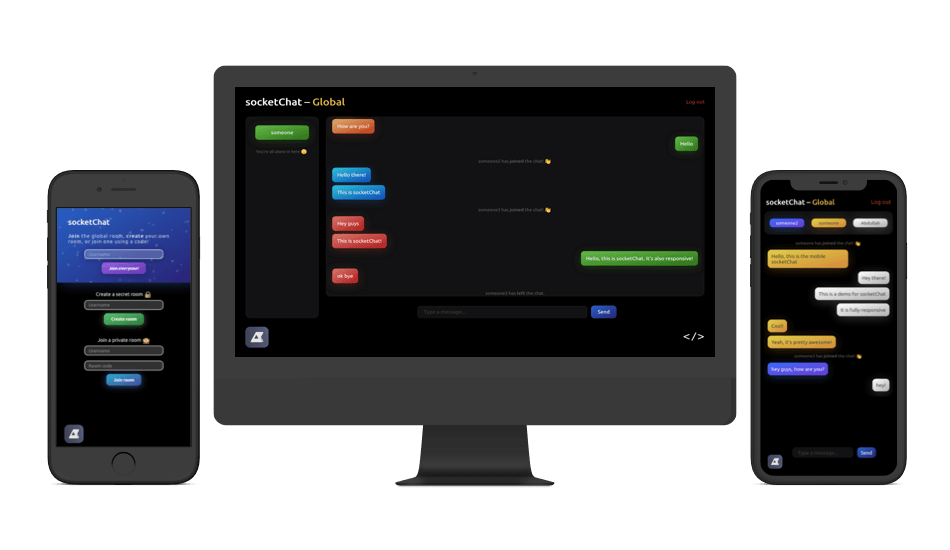

# socketChat

socketChat is a beautifully designed secure messaging application. It was built with [Express](https://expressjs.com/) and [Socket.io](https://socket.io).
 <!-- ## Demo:
##### Login demo:
 -->

## Run
If you'd like to run this app:
- `git clone https://github.com/abdullah-K/socketChat`.
- run `npm install` and let it do its thing
- run `node ./node_modules/gulp/bin/gulp.js` to get CSS files from SASS
- run `SESSIONSECRET="putyoursessionsecrethere" node index.js` and visit [localhost:4000](http://localhost:4000)
- have fun chatting with people!
